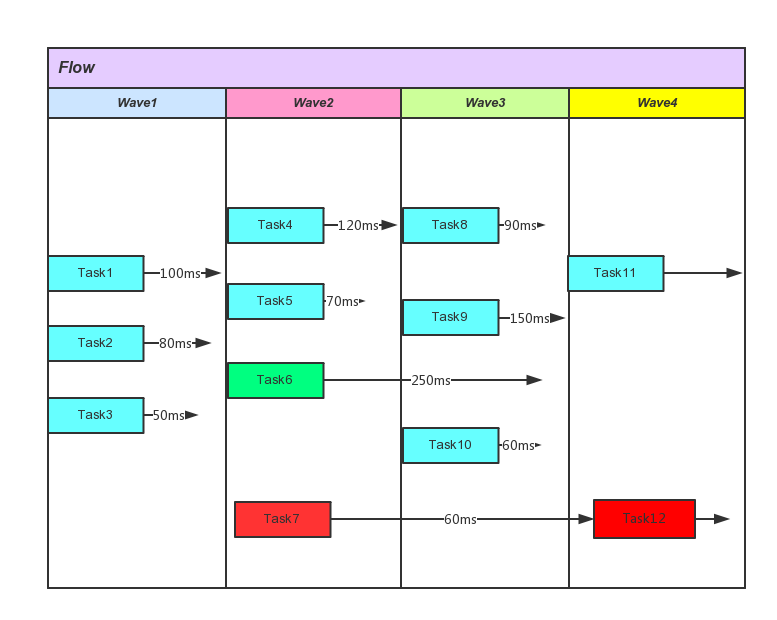

# Init [](https://maven-badges.herokuapp.com/maven-central/cn.zhaiyifan/init)
Init helps Android apps schedule initialization of application, with type, priority and multi-process (you know that every process will run application's onCreate), tidy magic code for every process, and improves efficiency of application start.

It is originally designed for application initialization, but not confined to that, it can be applied to any complex initialization procedure.

The library does not depend on any third-party library, it depends on Android in the case of Context and Log, and mostly depends on Java concurrent.

[For Chinese 中文戳这里](https://github.com/markzhai/init/blob/master/README_CN.md)

# How

The initialization procedure is abstracted to flow, wave and task.



Flow is a coarse-grained concept, normally we have only one flow, but under certain condition, we may have several flow like patch flow, fake UI flow(to make user feel faster), broadcast flow, etc.

Each wave can be started only when all blocked task in last wave finished, and all tasks belongs tothe wave will started at the same time(if no delay set).

As for task, they can be divided into two types
 1. Blocked task, blue tasks in the picture.
 2. Asynchronous task, can be
- completely asynchronous or across several waves like the green task.
- asynchronous task chain, like the two red tasks.

# Usage

```gradle
dependencies {
    compile 'cn.zhaiyifan:init:1.0.1'
}
```

```java
public class DemoApplication extends Application {

    @Override
    public void onCreate() {
        super.onCreate();

        // The library needs application context to get process information.
        Init.init(this);
        // Init.init(this, logProxy) enables custom log component
        
        Task task1 = new Task("task1") {

            @Override
            protected void start() {
                doSomeThing();
            }

            // when runs on process which makes the method return true
            @Override
            public boolean runOnProcess(String processName) {
                return processName.equals("cn.zhaiyifan.demo");
            }
        };
        
        // Create a task which is not blocked with 300 milliseconds delay.
        Task task2 = new Task("task2", false, 300) {

            @Override
            protected void start() {
                doSomeThing();
            }
        };

        // Create more tasks named task3, task4, task5, etc.
        ...

        // This is like the two red tasks in the flow picture, task5 depends on task4.
        task5.setParentTask(task4);

        Flow flow = new Flow("flow");
        // Add task1 and task2 to wave1
        flow.addTask(1, task1)
                .addTask(1, task2)
                // Add task3 and task4 to wave2
                .addTask(2, task3)
                .addTask(2, task4)
                // Add task5 and task4 to wave3, task5 can be started only after task4 finished
                .addTask(3, task5);

        Init.start(flow);
    }
```

Let's have a look at log, we can see that the initialization which may take up to 2700ms only run 1307ms now.
```log
10-04 18:53:54.789 646-666/cn.zhaiyifan.init I/Task: task2 runs 500
10-04 18:53:55.289 646-665/cn.zhaiyifan.init I/Task: task1 runs 1000
10-04 18:53:55.591 646-741/cn.zhaiyifan.init I/Task: task3 runs 300
10-04 18:53:55.592 646-646/cn.zhaiyifan.init I/Flow: flow runs 1307
10-04 18:53:55.990 646-740/cn.zhaiyifan.init I/Task: task4 runs 700
10-04 18:53:56.191 646-783/cn.zhaiyifan.init I/Task: task5 runs 200
```

See demo project for more details.

Useful api: 
```java
// to set thread pool size
Init.setThreadPoolSize(...)

// cancel a started flow
Init.cancel(...)

// get flow status
Init.getFlowStatus(...)

// get specific task status
flow.getTaskStatus(taskName)

// set timeout, may not be useful for application init, but can be used for other init operation
flow.setTimeout(5000)

etc.
```

# Why this
Imagine how we initialize a large application like Facebook, QQ, Wechat, etc, we will face sth like:

```java
public class XXXApplication {

    // for multi-dex apps
    @Override
    protected void attachBaseContext(Context base) {
        // log init
        ...
        // eventbus init...
        ...
        // global variables init
        ...
        // process related
        String processName = ...
        boolean isMainProcess = ...
        ProcessInit.attachBaseContext(this, processName, isMainProcess);
    }

    @Override
    protected void onCreate() {
        // process related
        String processName = ...
        boolean isMainProcess = ...

        // CrashHandler, SafeMode, plugin, image manager, database, download, update, etc init

        ProcessInit.onCreate(this, processName, isMainProcess);
    }

}

public class ProcessInit {
    ...
    public static void onCreate(Application application, boolean isMainProcess, String processName) {
        if (isMainProcess) {

        }
    } else if (processName.contains(PUSH_PROCESS_SUFFIX)) {
        ...
    } else if (processName.contains(WEB_PROCESS_SUFFIX)) {
        ...
    } else if (processName.contains(MUSIC_PROCESS_SUFFIX)) {
        ...
    } else {
        ...
    }
    ...
}
```

You see how complicated the initialization can be when the application grows, some operation should be after the other, and some can be done parallel, and some... Then we need to change the implementation of every init, to make some asynchronous, which makes code dirty and hard to understand.

How to make it simpler? I came up with this library.

# Roadmap
- 1.0 *October - A workable solution to principles mentioned above* DONE
- 1.1 **In this year - Support more complex init flow** WIP
- 2.0 Ability to reverse initialization code using this library to flow picture.

# Contribute
Contribution is welcomed, you can create an issue or directly make a pull request.